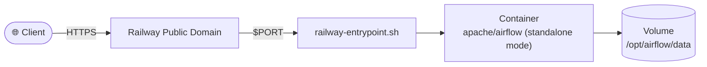

# Deploy and Host Apache Airflow on Railway


[](https://railway.com/deploy/9jXQaO?referralCode=2_sIT9&utm_medium=integration&utm_source=template&utm_campaign=generic)

Apache Airflow is an open-source platform for authoring, scheduling, and monitoring workflows as code. You define pipelines in Python (DAGs), and Airflow runs them on a schedule or on demand, with a web UI for logs, retries, and task dependencies. It is widely used for data engineering, ETL, and orchestrating jobs across databases, APIs, and cloud services.

## 🏗️ Architecture



Single-process **standalone** mode: webserver and scheduler run together in one container.

## About Hosting Apache Airflow

Hosting Airflow means running the webserver, scheduler, and—depending on your setup—workers and a metadata database. You configure environment variables for secrets and database connections, attach persistent storage for DAGs and state, and expose the web UI on a port your platform can route to. Health checks help the host restart unhealthy processes automatically. Production deployments often split components and use PostgreSQL with Celery or Kubernetes executors; this template uses **standalone** mode for a simpler single-process layout suited to evaluation and lighter workloads. Railway runs the container, wires networking and volumes, and lets you scale or add services as your orchestration needs grow.

## Common Use Cases

- **Data pipelines and ETL** — Ingest, transform, and load data between warehouses, lakes, and operational systems on a schedule or event-driven triggers.
- **ML and analytics orchestration** — Chain training, validation, batch scoring, and reporting steps with clear dependencies and observability.
- **Ops and integration workflows** — Run backups, syncs, API-driven jobs, and cross-system automation with retries and alerting via the Airflow UI.

## Dependencies for Apache Airflow Hosting

- **Container runtime** — Airflow is deployed as a container (this template uses the official [`apache/airflow`](https://hub.docker.com/r/apache/airflow) image).
- **Persistent storage** — A volume for DAGs and local metadata paths so restarts and redeploys do not wipe your workflows and data.

### Deployment Dependencies

- [Apache Airflow documentation](https://airflow.apache.org/docs/) — Concepts, configuration, and executors.
- [Running Airflow in Docker](https://airflow.apache.org/docs/apache-airflow/stable/howto/docker-compose/index.html) — Official Docker-oriented guidance (useful context even when deploying to Railway).
- [Railway volumes](https://docs.railway.com/guides/volumes) — Attaching persistent disks to your service.
- [Railway environment variables](https://docs.railway.com/guides/variables) — Managing secrets and configuration.

### Implementation Details

**Files in this template**

- `Dockerfile` — Uses the official `apache/airflow` image and installs any packages listed in `requirements.txt`.
- `docker-entrypoint.sh` — Starts Airflow in standalone mode on Railway `$PORT`.
- `railway.toml` — Health check, restart policy, and required volume mount.
- `requirements.txt` — Add extra PyPI packages your DAGs need here, then redeploy to rebuild the image.

**Environment variables**

```bash
AIRFLOW_UID=50000
AIRFLOW__CORE__LOAD_EXAMPLES=False
_AIRFLOW_WWW_USER_USERNAME=admin
_AIRFLOW_WWW_USER_PASSWORD=replace-with-strong-password
```

Setting `_AIRFLOW_WWW_USER_USERNAME` and `_AIRFLOW_WWW_USER_PASSWORD` seeds a fixed
admin login for Airflow 3's SimpleAuthManager, and the entrypoint stores its
password file on the persistent volume so the login survives restarts and
redeploys instead of Airflow generating a new random password each time. If you
leave these unset, Airflow auto-generates a random `admin` password on first boot
and logs it once to stdout.

**Persistent storage**

Attach a Railway volume and mount it to:

- `/opt/airflow/data`

The template enforces this with `requiredMountPath` in `railway.toml`. Task logs
and the SimpleAuthManager credentials file are also stored there so they survive
restarts and redeploys.

**Notes**

- Standalone mode is suited to evaluation and light workloads.
- For production at scale, split webserver, scheduler, and workers, and use PostgreSQL with a Celery or Kubernetes executor.
- SimpleAuthManager (Airflow 3's default auth manager, used by this template) is
  intended by upstream for development, testing, and small teams — not full
  RBAC/SSO. For production deployments that need that, switch
  `AIRFLOW__CORE__AUTH_MANAGER` to the FAB auth manager or the Keycloak auth
  manager (each requires adding its provider package to `requirements.txt`).
- The health check hits `/api/v2/monitor/health`, Airflow 3's documented
  monitoring endpoint. Railway only evaluates the HTTP status code, not the JSON
  body's per-component detail, so a `200` confirms the API server is responding
  but not that every component (e.g. the triggerer) is fully healthy.

## Why Deploy Apache Airflow on Railway?

<!-- Recommended: Keep this section as shown below -->
Railway is a singular platform to deploy your infrastructure stack. Railway will host your infrastructure so you don't have to deal with configuration, while allowing you to vertically and horizontally scale it.

By deploying Apache Airflow on Railway, you are one step closer to supporting a complete full-stack application with minimal burden. Host your servers, databases, AI agents, and more on Railway.
<!-- End recommended section -->

<!-- footer -->
---

[](https://github.com/vergissberlin/railwayapp-airbyte) [](https://github.com/vergissberlin/railwayapp-airflow) [](https://github.com/vergissberlin/railwayapp-cloudbeaver-ce) [](https://github.com/vergissberlin/railwayapp-codimd) [](https://github.com/vergissberlin/railwayapp-django) [](https://github.com/vergissberlin/railwayapp-email) [](https://github.com/vergissberlin/railwayapp-fastapi) [](https://github.com/vergissberlin/railwayapp-flask) [](https://github.com/vergissberlin/railwayapp-flowise) [](https://github.com/vergissberlin/railwayapp-gitlab) [](https://github.com/vergissberlin/railwayapp-grafana) [](https://github.com/vergissberlin/railwayapp-homeassistant) [](https://github.com/vergissberlin/railwayapp-influxdb) [](https://github.com/vergissberlin/railwayapp-mjml) [](https://github.com/vergissberlin/railwayapp-mongodb) [](https://github.com/vergissberlin/railwayapp-mqtt) [](https://github.com/vergissberlin/railwayapp-mysql) [](https://github.com/vergissberlin/railwayapp-n8n) [](https://github.com/vergissberlin/railwayapp-nodejs) [](https://github.com/vergissberlin/railwayapp-nodered) [](https://github.com/vergissberlin/railwayapp-opensearch) [](https://github.com/vergissberlin/railwayapp-openwebui) [](https://github.com/vergissberlin/railwayapp-operately) [](https://github.com/vergissberlin/railwayapp-outerbase-studio) [](https://github.com/vergissberlin/railwayapp-postgresql) [](https://github.com/vergissberlin/railwayapp-redis) [](https://github.com/vergissberlin/railwayapp-typo3)
